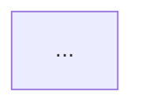

# Export Workflow

## Propósito

Este flujo define cómo exportar borradores académicos desde `Drafts/` hacia `PDF` y `DOCX` sin convertir el vault en una base de archivos técnicos.

La fuente canónica sigue siendo Markdown dentro del vault. La exportación solo ensambla, formatea y entrega.

Además, el pipeline debe producir un artefacto `LaTeX` editable antes del `PDF`, para que el usuario pueda revisar o ajustar detalles tipográficos si hace falta.

## Principios

- La verdad del documento vive en notas Markdown del vault.
- La exportación no reescribe el contenido académico; solo lo ensambla y lo formatea.
- Toda exportación sale como `draft` hasta que el usuario indique explícitamente `final`.
- El orden del documento no se adivina: lo define un manifiesto de exportación.
- El estilo de citas debe poder cambiarse por parámetro. `APA` es el default actual.
- `latex-paper-conversion` no es el flujo principal de exportación. Solo se usa si la plantilla LaTeX necesita adaptación estructural.

## Skill principal

Usar `@export-document` para:

- leer un manifiesto de exportación
- ensamblar notas de `Drafts/`
- aplicar metadatos académicos
- exportar a `PDF`
- exportar en paralelo a `DOCX`
- respetar el estado `draft` o `final`

## Stack técnico

- `pandoc` para ensamblado y exportación
- `tectonic` como motor PDF para la plantilla LaTeX
- `Academic-Engine/export/templates/thesis.tex` como plantilla PDF
- `Academic-Engine/export/templates/reference.docx` como base para Word
- `Academic-Engine/export/assets/thesis-watermark-2026.png` como watermark institucional para PDF
- `Academic-Engine/export/styles/apa.csl` como estilo de citas por defecto
- `Academic-Engine/scripts/export_document.py` como orquestador local

## Documento de control

Cada proyecto que vaya a exportarse debe tener un manifiesto:

- ubicación recomendada: `Projects/<Project Name>/EXPORT_MANIFEST.md`
- plantilla base: `00 System/Templates/export-manifest-template.md`
- la carpeta de proyecto debe existir antes de crear el manifiesto

## Flujo

### 1. Preparar el contenido

- escribir o revisar las notas relevantes en `Drafts/`
- confirmar que cada afirmación importante tenga respaldo
- cerrar vacíos fuertes antes de exportar

Si el contenido necesita mejora de prosa o estructura, usar `scientific-writing` antes de exportar.

### 2. Crear o actualizar el manifiesto

El manifiesto define:

- título
- autor o autores
- institución
- asesor
- estilo de citas
- estado del documento
- carpeta de salida
- orden exacto de los archivos Markdown

### 3. Ejecutar exportación

Comando base:

```bash
cd "Academic-Engine"
npm run export:document -- --manifest "/absolute/path/to/Academic Vault/Projects/Your Project/EXPORT_MANIFEST.md"
```

### 4. Revisar salidas

La exportación genera:

- `PDF`
- `DOCX`
- `Markdown` ensamblado
- `LaTeX` ensamblado y editable

Además:

- el `DOCX` hereda el watermark institucional desde `reference.docx`
- el `PDF` inyecta el mismo watermark como imagen de fondo
- el `PDF` se compila desde el `.tex` generado, no desde una exportación directa que oculte la capa LaTeX

Por defecto, las salidas deben ir a una carpeta `Exports/` dentro del proyecto correspondiente.

### 5. Aprobar versión final

Mientras el usuario no lo indique, mantener `document_status: draft`.

Solo cuando el usuario apruebe:

- cambiar a `document_status: final`
- volver a exportar

## Reglas de formato

- usar márgenes académicos estándar
- respetar indentación de párrafo
- mantener saltos de sección limpios
- usar numeración de secciones en tesis largas
- incluir tabla de contenido salvo que el usuario indique lo contrario
- mantener consistencia de referencias con CSL
- mantener el watermark institucional activo salvo que el usuario o los requisitos lo desactiven

## Artefacto LaTeX intermedio

Regla:

- toda exportación que genere `PDF` debe dejar también un archivo `.tex` en `Exports/`
- ese `.tex` debe ser legible y editable por el usuario
- si el usuario quiere intervenir la tipografía o pequeños detalles de layout, ese `.tex` es el artefacto correcto para hacerlo

Uso práctico:

- `--format latex` para generar solo el `.tex`
- `--format pdf` para generar `.tex` y luego compilar el `PDF`
- `all` para generar `Markdown`, `LaTeX`, `PDF` y `DOCX`

## Mermaid y figuras exportables

Los bloques `mermaid` ya no deben dejarse como código literal en la exportación.

Regla:

- durante export, el pipeline renderiza cada bloque `mermaid` a una imagen real
- el Markdown fuente del vault no se modifica
- la imagen renderizada se inserta en `PDF`, `DOCX` y en el Markdown exportado

Para dar caption a una figura Mermaid, usar una línea de comentario dentro del bloque:

```text

```

Si no se define caption, el exportador insertará una etiqueta genérica.

## Adaptación de estilos

- para `APA`, usar `apa.csl`
- para otros estilos, agregar o referenciar otro archivo `.csl`
- el contenido de `Drafts/` no debe depender de un estilo específico

## Watermark institucional

Por defecto:

- `DOCX` usa el watermark del modelo institucional cargado en `Academic-Engine/export/templates/reference.docx`
- `PDF` usa la imagen extraída en `Academic-Engine/export/assets/thesis-watermark-2026.png`

Si una entrega no debe llevar watermark, el manifiesto puede incluir:

```yaml
pdf_watermark: false
```

Si se necesita otra imagen de watermark para PDF:

```yaml
watermark_image: /absolute/path/to/other-watermark.png
watermark_width_pt: 441.65
watermark_height_pt: 445.70
```

## Cuándo usar `latex-paper-conversion`

Usarlo solo si:

- una institución entrega una plantilla LaTeX muy específica
- esa plantilla debe adaptarse para que Pandoc exporte bien
- hay que portar la salida a otra convención editorial

No usarlo como camino principal para exportar un proyecto Markdown normal.

## Regla operativa

- todo proyecto que tenga intención de entrega formal debe tener su `EXPORT_MANIFEST.md`
- la exportación hace parte del proceso de tesis, no es una tarea suelta al final
