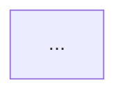

# Academic AI Vault

## Español

### Propósito

Este vault es un espacio de trabajo para investigación científica y escritura académica, diseñado para usarse con Obsidian y Codex.

Su propósito es:

- almacenar fuentes científicas en un formato reutilizable
- convertir PDFs y material web a Markdown analizable
- apoyar revisiones de literatura, hipótesis, borradores y tesis
- preservar metadata, procedencia y enlaces de origen
- mantener los resultados de investigación dentro del vault como memoria de largo plazo del proyecto

### Cómo se usa este proyecto

El modelo de trabajo es:

1. reunir fuentes
2. convertirlas y estructurarlas
3. clasificarlas con metadata y tags
4. sintetizarlas en notas de revisión
5. convertir la evidencia en hipótesis o secciones de tesis
6. guardar los resultados reutilizables en el vault

Codex se usa como agente de trabajo. Obsidian se usa como base de conocimiento visible para el usuario.

### Inicio rápido

Uso recomendado:

1. poner PDFs nuevos en `Sources/PDF Unconverted/`
2. pasar links web directamente en chat
3. crear o actualizar el proyecto en `Projects/<Project Name>/`
4. convertir fuentes y revisar `Sources/SOURCES_INDEX.md`
5. redactar o actualizar notas en `Reviews/`, `Drafts/` y `Hypotheses/`
6. exportar desde `EXPORT_MANIFEST.md` cuando haya una entrega

### Qué hace cada índice

- [MASTER_INDEX.md](./MASTER_INDEX.md>): tablero operativo global del vault
- [PROJECTS_INDEX.md](./Projects/PROJECTS_INDEX.md>): registro canónico de proyectos
- [SOURCES_INDEX.md](./Sources/SOURCES_INDEX.md>): registro canónico de fuentes convertidas y su uso aprobado por proyecto

### Flujos principales

#### Ingesta de PDFs

Qué hace:

- detecta PDFs pendientes
- extrae texto nativo o usa OCR si hace falta
- convierte a Markdown
- conserva metadata
- actualiza `SOURCES_INDEX.md`

Cómo usarlo:

- en chat: `@librarian process the pending PDFs`
- en terminal: `npm --prefix Academic-Engine run librarian`

#### Ingesta de páginas web

Qué hace:

- toma un link entregado en chat
- guarda el contenido como Markdown
- preserva metadata y URL de origen
- deja el resultado en `Sources/Web Converted/`

Cómo usarlo:

- en chat: `Procesa estos links, conviértelos a Markdown y clasifícalos`

#### Creación de proyectos

Qué hace:

- obliga a que cada proyecto viva dentro de su propia carpeta
- usa `PROJECT_INDEX.md` como ancla canónica
- organiza la escritura real en carpetas canónicas por proyecto dentro de `Drafts/`, `Reviews/` y `Hypotheses/`
- expone esas carpetas también como vistas por symlink dentro de `Projects/<Project Name>/`
- enlaza requirements, export y notas relacionadas

Cómo usarlo:

- crear carpeta: `Projects/<Project Name>/`
- crear carpetas canónicas:
  - `Drafts/<Project Name>/`
  - `Reviews/<Project Name>/`
  - `Hypotheses/<Project Name>/`
- crear desde templates: `PROJECT_INDEX.md`, `PROJECT_REQUIREMENTS.md`, `EXPORT_MANIFEST.md`
- crear vistas por symlink dentro del proyecto:
  - `Projects/<Project Name>/Drafts`
  - `Projects/<Project Name>/Reviews`
  - `Projects/<Project Name>/Hypotheses`
- terminar con: `npm --prefix Academic-Engine run fix:vault`

#### Reparación de drift

Qué hace:

- reconstruye índices globales
- corrige links legacy de proyectos
- crea o repara las vistas por symlink de `Drafts`, `Reviews` y `Hypotheses`
- mueve notas de proyecto sueltas a sus carpetas canónicas cuando detecta drift
- resincroniza `PROJECT_INDEX.md` con fuentes aprobadas y notas reales

Cómo usarlo:

- en chat: `@fix-vault repair the vault`
- en terminal: `npm --prefix Academic-Engine run fix:vault`

#### Exportación de entregables

Qué hace:

- ensambla notas Markdown desde `Drafts/`
- aplica estilo de citas
- genera un artefacto `LaTeX` editable
- exporta a `PDF` y `DOCX`
- mantiene `draft` como estado por defecto
- renderiza bloques `mermaid` como imágenes exportables
- conserva el watermark institucional en `DOCX` y `PDF`

Cómo usarlo:

- en chat: `@export-document export this project as draft`
- en terminal:

```bash
npm --prefix Academic-Engine run export:document -- --manifest "/absolute/path/to/Academic Vault/Projects/Your Project/EXPORT_MANIFEST.md"
```

Solo `LaTeX`:

```bash
npm --prefix Academic-Engine run export:document -- --manifest "/absolute/path/to/Academic Vault/Projects/Your Project/EXPORT_MANIFEST.md" --format latex
```

Si una entrega necesita salir sin watermark en PDF, agrega en el manifiesto:

```yaml
pdf_watermark: false
```

Si una nota usa Mermaid y quieres un título de figura exportable, usa esta sintaxis:

```text

```

### Ejemplos de uso en chat

- `@librarian process the pending PDFs`
- `Procesa estos links, conviértelos a Markdown, conserva metadata y guárdalos en Web Converted`
- `Crea un nuevo proyecto para esta tesis usando la estructura estándar`
- `@fix-vault repair the vault and resync project indices`
- `@export-document export the thesis as draft in APA`

### Estructura principal

- [00 System](./00 System>): reglas operativas, workflows y templates
- [Inbox](./Inbox>): captura rápida
- [Sources](./Sources>): PDFs, fuentes web y notas fuente convertidas
- [Sources/SOURCES_INDEX.md](./Sources/SOURCES_INDEX.md>): índice central de fuentes convertidas y proyectos aprobados
- [MASTER_INDEX.md](./MASTER_INDEX.md>): índice operativo global del vault
- [Reviews](./Reviews>): síntesis de literatura, organizadas canónicamente como `Reviews/<Project Name>/`
- [Hypotheses](./Hypotheses>): ideas testables y predicciones, organizadas canónicamente como `Hypotheses/<Project Name>/`
- [Drafts](./Drafts>): escritura académica y secciones de tesis, organizadas canónicamente como `Drafts/<Project Name>/`
- [Concepts](./Concepts>): notas conceptuales reutilizables
- [Projects](./Projects>): planificación y ejecución por proyecto, con vistas por symlink a `Drafts`, `Reviews` y `Hypotheses`
- [Projects/Requirements](./Projects/Requirements>): parámetros de entrega, restricciones y criterios de evaluación

### Regla de rutas canónicas y vistas por symlink

- La escritura real de proyecto vive en:
  - `Drafts/<Project Name>/`
  - `Reviews/<Project Name>/`
  - `Hypotheses/<Project Name>/`
- Dentro de `Projects/<Project Name>/`, `Drafts`, `Reviews` y `Hypotheses` son solo vistas por symlink para navegar cómodamente desde el proyecto.
- `PROJECT_INDEX.md` y `EXPORT_MANIFEST.md` deben apuntar a las rutas canónicas, no a las vistas por symlink.
- `fix:vault` es el mecanismo que crea o repara estas vistas y corrige drift de ubicación.

### Reglas base

- `Academic Vault` contiene solo notas y artefactos fuente. No se debe colocar código de desarrollo aquí.
- `Academic-Engine/` fuera del vault contiene MCP, tooling local, imported skills y configuración técnica.
- Los resultados valiosos de investigación deben guardarse en el vault, no quedarse solo en el chat.
- Cada proyecto real debe vivir dentro de su propia carpeta en `Projects/`.
- Cada proyecto también debe tener carpetas canónicas en `Drafts/`, `Reviews/` y `Hypotheses/`, más vistas por symlink dentro de `Projects/<Project Name>/`.
- La exportación y los índices usan siempre las rutas canónicas, nunca las vistas por symlink.
- Los PDFs entran por `Sources/PDF Unconverted/` y pasan a `Sources/PDF Converted/` después del procesamiento.
- Las fuentes web se entregan directamente como URLs en chat y se guardan en `Sources/Web Converted/`.
- Las notas fuente convertidas deben preservar metadata y procedencia.
- Las URLs de origen del material web deben guardarse en el frontmatter y también en el cuerpo de la nota.

### Regla específica de este proyecto

- Este `README.md` debe mantener siempre enlaces al archivo de referencia de skills y a los documentos principales de workflow usados para desarrollar y operar el proyecto.

### Documentos clave

- [AGENTS.md](./00 System/AGENTS.md>)
- [RESEARCH_WORKFLOW.md](./00 System/RESEARCH_WORKFLOW.md>)
- [PROJECT_WORKFLOW.md](./00 System/PROJECT_WORKFLOW.md>)
- [THESIS_WORKFLOW.md](./00 System/THESIS_WORKFLOW.md>)
- [PDF_INGEST_WORKFLOW.md](./00 System/PDF_INGEST_WORKFLOW.md>)
- [WEB_TEXT_INGEST_WORKFLOW.md](./00 System/WEB_TEXT_INGEST_WORKFLOW.md>)
- [SOURCES_INDEX_WORKFLOW.md](./00 System/SOURCES_INDEX_WORKFLOW.md>)
- [EXPORT_WORKFLOW.md](./00 System/EXPORT_WORKFLOW.md>)
- [EXPORT_STYLES.md](./00 System/EXPORT_STYLES.md>)
- [SKILLS_REFERENCE.md](./00 System/SKILLS_REFERENCE.md>)
- [PROJECT_REQUIREMENTS.md](./Projects/Requirements/PROJECT_REQUIREMENTS.md>) intake global de requerimientos antes de asignarlos a un proyecto concreto
- [MASTER_INDEX.md](./MASTER_INDEX.md>)
- [PROJECTS_INDEX.md](./Projects/PROJECTS_INDEX.md>)
- [librarian skill](</Users/jaymusicmachine/.codex/skills/librarian/SKILL.md>)
- [export-document skill](</Users/jaymusicmachine/.codex/skills/export-document/SKILL.md>)
- [fix-vault skill](</Users/jaymusicmachine/.codex/skills/fix-vault/SKILL.md>)

### Templates

- [Templates](./00 System/Templates>)
- [source-template.md](./00 System/Templates/source-template.md>)
- [review-template.md](./00 System/Templates/review-template.md>)
- [hypothesis-template.md](./00 System/Templates/hypothesis-template.md>)
- [draft-template.md](./00 System/Templates/draft-template.md>)
- [project-template.md](./00 System/Templates/project-template.md>)
- [requirements-template.md](./00 System/Templates/requirements-template.md>)
- [export-manifest-template.md](./00 System/Templates/export-manifest-template.md>)

### Referencias de desarrollo

- [Academic-Engine/README.md](../Academic-Engine/README.md>)
- [Academic-Engine/package.json](../Academic-Engine/package.json>)
- [Academic-Engine/config/obsidian-mcp.json](../Academic-Engine/config/obsidian-mcp.json>)
- [Academic-Engine/export/README.md](../Academic-Engine/export/README.md>)
- `npm run fix:vault`

## English

### Purpose

This vault is a scientific research and academic writing workspace designed to be used with Obsidian and Codex.

Its purpose is to:

- store scientific sources in reusable form
- convert PDFs and web material into analyzable Markdown
- support literature reviews, hypotheses, drafts, and thesis writing
- preserve metadata, provenance, and source links
- keep research outputs inside the vault as long-term project memory

### How This Project Is Used

The operating model is:

1. gather sources
2. convert and structure them
3. classify them with metadata and tags
4. synthesize them into review notes
5. turn evidence into hypotheses or thesis sections
6. keep reusable outputs in the vault

Codex is used as the working agent. Obsidian is used as the human-facing knowledge base.

### Quick Start

Recommended usage:

1. place new PDFs in `Sources/PDF Unconverted/`
2. pass web links directly in chat
3. create or update the project in `Projects/<Project Name>/`
4. convert sources and review `Sources/SOURCES_INDEX.md`
5. write or update notes in `Reviews/`, `Drafts/`, and `Hypotheses/`
6. export from `EXPORT_MANIFEST.md` when a deliverable is needed

### What Each Index Does

- [MASTER_INDEX.md](./MASTER_INDEX.md>): global operational dashboard of the vault
- [PROJECTS_INDEX.md](./Projects/PROJECTS_INDEX.md>): canonical registry of projects
- [SOURCES_INDEX.md](./Sources/SOURCES_INDEX.md>): canonical registry of converted sources and their approved project usage

### Main Workflows

#### PDF Intake

What it does:

- detects pending PDFs
- extracts native text or falls back to OCR
- converts to Markdown
- preserves metadata
- updates `SOURCES_INDEX.md`

How to use it:

- in chat: `@librarian process the pending PDFs`
- in terminal: `npm --prefix Academic-Engine run librarian`

#### Web Page Intake

What it does:

- takes a link provided in chat
- saves the content as Markdown
- preserves metadata and source URL
- stores the result in `Sources/Web Converted/`

How to use it:

- in chat: `Process these links, convert them to Markdown, and classify them`

#### Project Creation

What it does:

- enforces a dedicated folder for each project
- uses `PROJECT_INDEX.md` as the canonical anchor
- keeps the real writing in canonical per-project folders under `Drafts/`, `Reviews/`, and `Hypotheses/`
- exposes those same folders as symlink views inside `Projects/<Project Name>/`
- links requirements, export, and related notes

How to use it:

- create folder: `Projects/<Project Name>/`
- create canonical folders:
  - `Drafts/<Project Name>/`
  - `Reviews/<Project Name>/`
  - `Hypotheses/<Project Name>/`
- create from templates: `PROJECT_INDEX.md`, `PROJECT_REQUIREMENTS.md`, `EXPORT_MANIFEST.md`
- create symlink views inside the project:
  - `Projects/<Project Name>/Drafts`
  - `Projects/<Project Name>/Reviews`
  - `Projects/<Project Name>/Hypotheses`
- finish with: `npm --prefix Academic-Engine run fix:vault`

#### Drift Repair

What it does:

- rebuilds global indices
- fixes legacy project links
- creates or repairs the `Drafts`, `Reviews`, and `Hypotheses` symlink views
- moves loose project notes into their canonical thematic project folders when it detects drift
- resynchronizes `PROJECT_INDEX.md` with approved sources and real notes

How to use it:

- in chat: `@fix-vault repair the vault`
- in terminal: `npm --prefix Academic-Engine run fix:vault`

#### Deliverable Export

What it does:

- assembles Markdown notes from `Drafts/`
- applies citation style
- generates an editable `LaTeX` artifact
- exports to `PDF` and `DOCX`
- keeps `draft` as the default state
- renders `mermaid` blocks as exportable images
- preserves the institutional watermark in `DOCX` and `PDF`

How to use it:

- in chat: `@export-document export this project as draft`
- in terminal:

```bash
npm --prefix Academic-Engine run export:document -- --manifest "/absolute/path/to/Academic Vault/Projects/Your Project/EXPORT_MANIFEST.md"
```

`LaTeX` only:

```bash
npm --prefix Academic-Engine run export:document -- --manifest "/absolute/path/to/Academic Vault/Projects/Your Project/EXPORT_MANIFEST.md" --format latex
```

If a deliverable must be exported without the PDF watermark, add this to the manifest:

```yaml
pdf_watermark: false
```

If a note uses Mermaid and you want an exportable figure caption, use this syntax:

```text

```

### Example Chat Requests

- `@librarian process the pending PDFs`
- `Process these links, convert them to Markdown, preserve metadata, and save them in Web Converted`
- `Create a new project for this thesis using the standard structure`
- `@fix-vault repair the vault and resync project indices`
- `@export-document export the thesis as draft in APA`

### Main Structure

- [00 System](./00 System>): operational rules, workflows, and templates
- [Inbox](./Inbox>): quick capture
- [Sources](./Sources>): PDFs, web sources, and converted source notes
- [Sources/SOURCES_INDEX.md](./Sources/SOURCES_INDEX.md>): central index of converted sources and approved project usage
- [MASTER_INDEX.md](./MASTER_INDEX.md>): global operational index of the vault
- [Reviews](./Reviews>): literature synthesis, canonically organized as `Reviews/<Project Name>/`
- [Hypotheses](./Hypotheses>): testable ideas and predictions, canonically organized as `Hypotheses/<Project Name>/`
- [Drafts](./Drafts>): academic writing and thesis sections, canonically organized as `Drafts/<Project Name>/`
- [Concepts](./Concepts>): reusable conceptual notes
- [Projects](./Projects>): project-level planning and execution, with symlink views to `Drafts`, `Reviews`, and `Hypotheses`
- [Projects/Requirements](./Projects/Requirements>): delivery requirements, constraints, and evaluation criteria

### Canonical Paths And Symlink Views Rule

- Real project writing lives in:
  - `Drafts/<Project Name>/`
  - `Reviews/<Project Name>/`
  - `Hypotheses/<Project Name>/`
- Inside `Projects/<Project Name>/`, `Drafts`, `Reviews`, and `Hypotheses` are symlink views only for convenient navigation.
- `PROJECT_INDEX.md` and `EXPORT_MANIFEST.md` must point to canonical paths, not to the symlink views.
- `fix:vault` is the mechanism that creates or repairs these views and fixes placement drift.

### Core Rules

- `Academic Vault` contains notes and source artifacts only. Do not place Academic-Engine code here.
- `Academic-Engine/` outside the vault contains MCP, local tooling, imported skills, and technical setup.
- Valuable research outputs should be saved in the vault, not left only in chat.
- Every real project must live inside its own folder under `Projects/`.
- Every project must also have canonical folders under `Drafts/`, `Reviews/`, and `Hypotheses/`, plus symlink views inside `Projects/<Project Name>/`.
- Export and indexing always use canonical paths, never the symlink views.
- PDFs enter through `Sources/PDF Unconverted/` and move to `Sources/PDF Converted/` after processing.
- Web sources are provided directly as URLs in chat and are saved to `Sources/Web Converted/`.
- Converted source notes must preserve metadata and provenance.
- Source URLs for web material must be stored in frontmatter and in the note body.

### Specific Rule For This Project

- This `README.md` must always link to the skills reference and the main workflow documents used to develop and operate the project.

### Key Documents

- [AGENTS.md](./00 System/AGENTS.md>)
- [RESEARCH_WORKFLOW.md](./00 System/RESEARCH_WORKFLOW.md>)
- [PROJECT_WORKFLOW.md](./00 System/PROJECT_WORKFLOW.md>)
- [THESIS_WORKFLOW.md](./00 System/THESIS_WORKFLOW.md>)
- [PDF_INGEST_WORKFLOW.md](./00 System/PDF_INGEST_WORKFLOW.md>)
- [WEB_TEXT_INGEST_WORKFLOW.md](./00 System/WEB_TEXT_INGEST_WORKFLOW.md>)
- [SOURCES_INDEX_WORKFLOW.md](./00 System/SOURCES_INDEX_WORKFLOW.md>)
- [EXPORT_WORKFLOW.md](./00 System/EXPORT_WORKFLOW.md>)
- [EXPORT_STYLES.md](./00 System/EXPORT_STYLES.md>)
- [SKILLS_REFERENCE.md](./00 System/SKILLS_REFERENCE.md>)
- [PROJECT_REQUIREMENTS.md](./Projects/Requirements/PROJECT_REQUIREMENTS.md>) global requirements intake before assigning them to a specific project
- [MASTER_INDEX.md](./MASTER_INDEX.md>)
- [PROJECTS_INDEX.md](./Projects/PROJECTS_INDEX.md>)
- [librarian skill](</Users/jaymusicmachine/.codex/skills/librarian/SKILL.md>)
- [export-document skill](</Users/jaymusicmachine/.codex/skills/export-document/SKILL.md>)
- [fix-vault skill](</Users/jaymusicmachine/.codex/skills/fix-vault/SKILL.md>)

### Templates

- [Templates](./00 System/Templates>)
- [source-template.md](./00 System/Templates/source-template.md>)
- [review-template.md](./00 System/Templates/review-template.md>)
- [hypothesis-template.md](./00 System/Templates/hypothesis-template.md>)
- [draft-template.md](./00 System/Templates/draft-template.md>)
- [project-template.md](./00 System/Templates/project-template.md>)
- [requirements-template.md](./00 System/Templates/requirements-template.md>)
- [export-manifest-template.md](./00 System/Templates/export-manifest-template.md>)

### Development References

- [Academic-Engine/README.md](../Academic-Engine/README.md>)
- [Academic-Engine/package.json](../Academic-Engine/package.json>)
- [Academic-Engine/config/obsidian-mcp.json](../Academic-Engine/config/obsidian-mcp.json>)
- [Academic-Engine/export/README.md](../Academic-Engine/export/README.md>)
- `npm run fix:vault`
