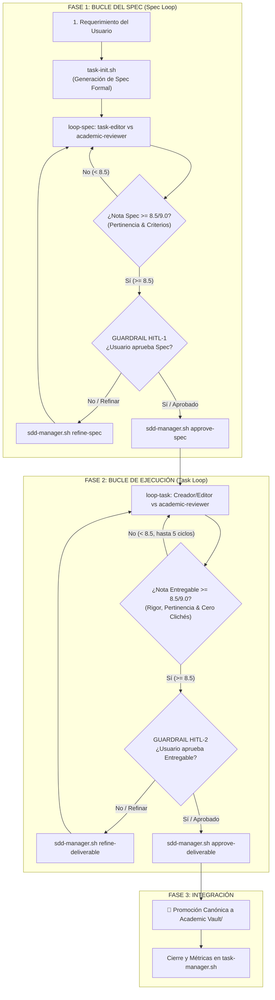

# 🤖 SENA - Robot Tareas | Academic AI Studio

> Entorno de desarrollo agéntico híbrido para la formación en **Programación de Software** del **SENA (Servicio Nacional de Aprendizaje)**, ingeniería de software y creación de productos tecnológicos con arquitectura desacoplada y gobernanza estricta.

[](Academic-Engine/tests/smoke-test.sh)
[-blue)](Academic-Engine/tests/test-idempotency.sh)
[](Academic-Engine/scripts/validate-skills.sh)
[](Academic-Engine/scripts/inspect-squad.sh)
[](Academic-Engine/context/course-profile.md)
[](Academic-Engine/scripts/sdd-manager.sh)

---

## 📋 Tabla de Contenidos

1. [Visión General & Propósito](#-visión-general--propósito)
2. [Arquitectura del Sistema (Motor vs. Bóveda)](#-arquitectura-del-sistema-motor-vs-bóveda)
3. [El Squad de 12 Sub-Agentes](#-el-squad-de-12-sub-agentes)
4. [Protocolo SDD con Doble Guardrail Humano (HITL)](#-protocolo-sdd-con-doble-guardrail-humano-hitl)
5. [Catálogo de Comandos Operativos (.sh y .ps1)](#-catálogo-de-comandos-operativos)
6. [Catálogo de 65 Habilidades (Skills)](#-catálogo-de-65-habilidades-skills)
7. [Instalación & Activación Rápida](#-instalación--activación-rápida)
8. [Suites de Verificación & Testing](#-suites-de-verificación--testing)
9. [Regla de Refinamiento No Destructivo](#-regla-de-refinamiento-no-destructivo)
10. [Atribución de Commits](#-atribución-de-commits)

---

## 🎯 Visión General & Propósito

**SENA - Robot Tareas** es una estación de trabajo de ingeniería de software aumentada con IA diseñada para asistir al aprendiz **Julian David Sosa Rico** en el programa formativo de **Programación de Software** del **SENA (Servicio Nacional de Aprendizaje)** en modalidad **100% Virtual**.

El sistema integra dos dimensiones operativas que comparten el mismo motor de ejecución:

1. **Dimensión Académica & Computer Science (CS):**
   - Generación y sustentación de evidencias de aprendizaje:
     - **Evidencias de Conocimiento (EC):** Mapas conceptuales, comparativas técnicas, análisis algorítmicos.
     - **Evidencias de Desempeño (ED):** Demostraciones, sustentaciones, revisiones de código, pruebas.
     - **Evidencias de Producto (EP):** Repositorios con pruebas unitarias, diagramas UML, scripts de bases de datos relacionales (MySQL/PostgreSQL), especificaciones SRS (IEEE 830), manuales técnicos e informes en PDF (APA 7).
   - Aplicación estricta de principios de **Clean Code**, **SOLID**, patrones de diseño (GoF) y arquitectura en capas/MVC.

2. **Dimensión de Producto & Venture:**
   - Modelado económico y de negocio (SaaS, fee architecture, CAC/LTV).
   - Preparación de pitch decks institucionales (YC y Sequoia) y exportación nativa a `.pptx`.
   - Cumplimiento normativo y contratos inteligentes sobre Solana (estándar Metaplex Core).
   - Generación de parrillas de contenido técnico y prospección B2B.

---

## 🏗️ Arquitectura del Sistema (Motor vs. Bóveda)

El espacio de trabajo mantiene una separación radical entre la lógica de ejecución y la base de conocimiento:

```text
sena-programacion-robot-tareas/
├── .gitignore
├── AGENTS.md                         # Protocolo maestro, guardrails HITL y directivas de agentes
├── README.md                         # Este documento de arquitectura y guía de uso
├── Academic-Engine/                  # ⚙️ MOTOR DE EJECUCIÓN (Source of Truth de herramientas)
│   ├── agents/                       # 13 archivos YAML de sub-agentes autónomos
│   ├── context/                      # Perfil formativo SENA, estándares CS y guías de redacción
│   │   ├── course-profile.md         # Perfil curricular y competencias SENA
│   │   ├── cs-standards.md           # Estándares de calidad de software y Clean Code
│   │   ├── academic-writing-guide.md # Guía de estilo APA 7, IEEE y redacción técnica
│   │   └── export-config.md          # Configuración del pipeline Pandoc / LaTeX
│   ├── docs/                         # Manuales de workflows y taxonomía de archivos
│   ├── outputs/                      # Salidas temporales generadas (decks .pptx, etc.)
│   ├── scripts/                      # 24 scripts automatizados con paridad .sh y .ps1
│   ├── skills/                       # 65 habilidades validadas (Agent Skills Specification)
│   ├── templates/                    # Plantillas Markdown, LaTeX y esquemas JSON
│   └── tests/                        # Suites de smoke test y verificación de idempotencia
└── Academic Vault/                   # 📚 BÓVEDA OBSIDIAN (Base de conocimiento y entregables)
    ├── .obsidian/                    # Configuración de Obsidian (plugins y temas)
    ├── 00 System/                    # Vistas de workflows, plantillas locales y gobernanza
    ├── Concepts/                     # Notas atómicas de conceptos teóricos y tecnológicos
    ├── Drafts/                       # Secciones de manuscritos, evidencias formativas y posts
    ├── Exports/                      # Salidas compiladas finales (PDF, DOCX, LaTeX)
    ├── Hypotheses/                   # Reivindicaciones comprobables y diseño experimental
    ├── Inbox/                        # Capturas crudas, sesiones de tarea y specs SDD
    │   ├── Archive/                  # Snapshots automáticos de seguridad (refinamiento)
    │   └── Specs/                    # Especificaciones formales en ciclo HITL
    ├── Projects/                     # Proyectos estructurados (vistas symlinks relativas)
    │   └── Requirements/             # Requisitos funcionales y no funcionales
    ├── Reviews/                      # Revisiones de código, literatura y síntesis temáticas
    └── Sources/                      # Biblioteca canónica de fuentes ingresadas (PDF y Web)
        ├── PDF Converted/            # PDFs transformados a Markdown estructurado
        ├── PDF Unconverted/          # Bandeja de entrada para PDFs pendientes de ingesta
        ├── Web Converted/            # Artículos web ingestados con procedencia y metadata
        └── SOURCES_INDEX.md          # Registro canónico maestro de todas las fuentes
```

---

## 🤖 El Squad de 13 Sub-Agentes

El motor cuenta con un escuadrón de 13 agentes especializados definidos en `Academic-Engine/agents/*.yaml`:

### 🎓 Sub-Agentes Académicos, Computer Science & Optimización (7 agentes)

| Identificador | Rol | Misión Principal | Salidas Canónicas |
|---|---|---|---|
| `cs-tutor` | Tutor de CS & Desarrollo de Software | Explicar algoritmos, estructuras de datos, POO, bases de datos y guiar ejercicios prácticos con feedback formativo. | `Academic Vault/Drafts/`, `Concepts/` |
| `code-reviewer` | Arquitecto de Calidad & Code Reviewer | Auditar código bajo Clean Code, SOLID, patrones GoF, cobertura de tests y seguridad OWASP. | `Academic Vault/Reviews/` |
| `research-librarian` | Bibliotecario de Investigación Académica | Ingestar PDFs y URLs web, enriquecer metadatos YAML, validar procedencia y gestionar `SOURCES_INDEX.md`. | `Academic Vault/Sources/` |
| `thesis-writer` | Redactor Académico & Ghostwriter Técnico | Redactar informes técnicos, evidencias escritas y artículos con rigor metodológico (APA 7 / IEEE). | `Academic Vault/Drafts/` |
| `methodology-consultant` | Consultor Metodológico & Estadístico | Diseñar instrumentos de investigación (encuestas, experimentos), análisis cuantitativo/cualitativo y UML. | `Academic Vault/Concepts/`, `Hypotheses/` |
| `academic-reviewer` | Revisor Científico y Editorial (Auditor) | Auditar specs y borradores en bucles autónomos (escala 0-9 pts) evaluando pertinencia, rigor, fuentes y cero clichés. | `Academic Vault/Reviews/` |
| `task-editor` | Editor Técnico & Optimizador de Calidad | Contraparte editora de los revisores: aplica remediaciones no destructivas a specs y borradores hasta superar >= 8.5/9.0. | `Academic Vault/Drafts/`, `Inbox/Specs/` |

### 💼 Sub-Agentes de Negocio, Producto & Venture (6 agentes)

| Identificador | Rol | Misión Principal | Salidas Canónicas |
|---|---|---|---|
| `business-consultant` | Arquitecto de Modelos de Negocio | Diseñar arquitectura de tarifas SaaS, proyecciones pro forma a 3-5 años y viabilidad económica para aceleradoras (YC). | `Academic Vault/Drafts/`, `Concepts/` |
| `market-research-analyst` | Analista de Mercado & TAM/SAM/SOM | Dimensionamiento de mercado (top-down y bottom-up) y matrices comparativas de competidores. | `Academic Vault/Drafts/`, `Concepts/` |
| `pitch-deck-architect` | Arquitecto de Pitch Decks (YC/Sequoia) | Estructurar narrativas de 10-12 slides y generar archivos `.pptx` nativos mediante `python-pptx`. | `Academic Vault/Drafts/`, `outputs/decks/` |
| `compliance-officer` | Oficial de Cumplimiento & RWA | Desacoplamiento corporativo (Delaware C-Corp vs SPV), KYC/AML con Stripe Identity y gobernanza multi-sig. | `Academic Vault/Drafts/`, `Reviews/` |
| `b2b-sponsor-lead` | Adquisición de Sponsors & RevOps | Propuesta de valor para desarrolladores B2B, secuencias de prospección en frío y flujos de onboarding. | `Academic Vault/Drafts/` |
| `founder-ghostwriter` | Storyteller & Voz Fundadora | Ensayos de aplicación a YC, artículos técnicos en LinkedIn y reflexiones de arquitectura en X (Twitter). | `Academic Vault/Drafts/` |

---

## 🛡️ Protocolo SDD con Doble Bucle Revisor-Editor y Doble Guardrail Humano (HITL)

Para erradicar la alucinación, el texto genérico y la deriva conceptual (*prompt drift*), todas las tareas de generación de especificaciones y entregables siguen la arquitectura de **Doble Bucle Revisor-Editor** con dos puntos de control humano obligatorio (*Human-in-the-Loop*):



### Dimensiones de Evaluación de Pertinencia y Calidad (Escala 0 a 9.0)

Tanto en la fase de especificación como en la entrega final, el **Agente Revisor** audita contra 4 dimensiones obligatorias:

1. **Pertinencia con los Requisitos & Objetivo Solicitado (2.5 pts):** Cobertura total de los requerimientos pedidos por el usuario, alineación con la audiencia (aprendices SENA / desarrollo de software), claridad del problema y cierre accionable.
2. **Rigor Científico/Técnico & Estándares de Software (2.5 pts):** Fundamentación en Clean Code, principios SOLID, patrones arquitectónicos, testing riguroso y ausencia de promesas especulativas.
3. **Claridad, Coherencia & Estructura (2.0 pts):** Jerarquía lógica visual, completitud de secciones, concisión y ausencia de prosa pasiva.
4. **Originalidad Léxica & Cero Clichés de IA (2.0 pts):** Tolerancia cero a frases hechas de LLMs (penalización automática por muletillas como *"en el vertiginoso mundo"*, *"juega un papel crucial"*, *"cambio de paradigma"*, *"en resumen"*, etc.).

**Umbral Mínimo Aprobatorio:** $\mathbf{\ge 8.5 / 9.0}$.

---

## 💻 Catálogo de Comandos Operativos

Todos los scripts cuentan con paridad 1:1 entre entornos UNIX/macOS (`.sh`) y PowerShell nativo en Windows (`.ps1`):

| Tarea Operativa | Comando Bash (macOS / Linux / WSL) | Comando PowerShell (Windows) |
|---|---|---|
| **Bucle Autónomo Universal (>= 8.5)** | `bash Academic-Engine/scripts/task-loop.sh <slug> ["<reqs>"] ["<meta>"]` | `powershell -File .\Academic-Engine\scripts\task-loop.ps1 <slug> ...` |
| **Inicialización Atómica SDD** | `bash Academic-Engine/scripts/task-init.sh <slug> [titulo] [carpeta] [agentes] [icp] [meta]` | `powershell -File .\Academic-Engine\scripts\task-init.ps1 <slug> ...` |
| **Bucle del Spec (Spec-Loop >= 8.5)** | `bash Academic-Engine/scripts/sdd-manager.sh loop-spec <slug>` | `powershell -File .\Academic-Engine\scripts\sdd-manager.ps1 loop-spec <slug>` |
| **Aprobar Spec (HITL-1)** | `bash Academic-Engine/scripts/sdd-manager.sh approve-spec <slug>` | `powershell -File .\Academic-Engine\scripts\sdd-manager.ps1 approve-spec <slug>` |
| **Bucle de la Tarea (Task-Loop >= 8.5)** | `bash Academic-Engine/scripts/sdd-manager.sh loop-task <slug> [draft.md]` | `powershell -File .\Academic-Engine\scripts\sdd-manager.ps1 loop-task <slug>` |
| **Revisar y Aprobar Entregable (HITL-2)** | `bash Academic-Engine/scripts/sdd-manager.sh <review-deliverable\|approve-deliverable> <slug>` | `powershell -File .\Academic-Engine\scripts\sdd-manager.ps1 <cmd> <slug>` |
| **Auditoría de Texto Libre (0 a 9)** | `bash Academic-Engine/scripts/sdd-manager.sh audit-text <archivo.md>` | `powershell -File .\Academic-Engine\scripts\sdd-manager.ps1 audit-text <archivo.md>` |
| **Ingesta de PDFs** | `bash Academic-Engine/scripts/ingest-pdf.sh [archivo.pdf]` | `powershell -File .\Academic-Engine\scripts\ingest-pdf.ps1 [archivo.pdf]` |
| **Ingesta de URLs Web** | `bash Academic-Engine/scripts/ingest-web.sh <url> [titulo]` | `powershell -File .\Academic-Engine\scripts\ingest-web.ps1 <url> [titulo]` |
| **Sincronizar Índice de Fuentes** | `bash Academic-Engine/scripts/sync-sources-index.sh` | `powershell -File .\Academic-Engine\scripts\sync-sources-index.ps1` |
| **Scaffold de Nuevo Proyecto** | `bash Academic-Engine/scripts/new-project.sh "<nombre>" "[meta]" "[autor]"` | `powershell -File .\Academic-Engine\scripts\new-project.ps1 "<nombre>" ...` |
| **Reparación y Linter de Bóveda** | `bash Academic-Engine/scripts/fix-vault.sh` | `powershell -File .\Academic-Engine\scripts\fix-vault.ps1` |
| **Refinamiento No Destructivo** | `bash Academic-Engine/scripts/refine-note.sh <inspect\|backup\|refine\|branch\|rollback> <ruta>` | `powershell -File .\Academic-Engine\scripts\refine-note.ps1 <cmd> <ruta>` |
| **Gestión de Sesiones de Tarea** | `bash Academic-Engine/scripts/task-manager.sh <init\|add\|show\|update\|list\|close> ...` | `powershell -File .\Academic-Engine\scripts\task-manager.ps1 <cmd> ...` |
| **Exportar a PDF / LaTeX** | `bash Academic-Engine/scripts/export-pdf.sh <archivo.md\|.tex> [salida.pdf] [--open]` | `powershell -File .\Academic-Engine\scripts\export-pdf.ps1 <archivo> ...` |
| **Auditoría de Habilidades** | `bash Academic-Engine/scripts/validate-skills.sh` | `powershell -File .\Academic-Engine\scripts\validate-skills.ps1` |
| **Activar Habilidades en Agente** | `bash Academic-Engine/scripts/enable-project-skills.sh` | `powershell -File .\Academic-Engine\scripts\enable-project-skills.ps1` |
| **Inspección de Sub-Agentes** | `bash Academic-Engine/scripts/inspect-squad.sh` | `powershell -File .\Academic-Engine\scripts\inspect-squad.ps1` |
| **Smoke Test de Integración** | `bash Academic-Engine/tests/smoke-test.sh` | `powershell -File .\Academic-Engine\tests\smoke-test.ps1` |
| **Pruebas de Idempotencia** | `bash Academic-Engine/tests/test-idempotency.sh` | `powershell -File .\Academic-Engine\tests\test-idempotency.ps1` |
| **Auditoría de Gobernanza** | `bash Academic-Engine/scripts/validate-vault.sh` | `powershell -File .\Academic-Engine\scripts\validate-vault.ps1` |
| **Auditoría Anti-Deriva (Enforce)**| `bash Academic-Engine/scripts/enforce-compliance.sh` | `powershell -File .\Academic-Engine\scripts\enforce-compliance.ps1` |
| **Ingesta de PDFs** | `bash Academic-Engine/scripts/ingest-pdf.sh [archivo.pdf]` | `powershell -File .\Academic-Engine\scripts\ingest-pdf.ps1 [archivo.pdf]` |
| **Ingesta de URLs Web** | `bash Academic-Engine/scripts/ingest-web.sh <url> [titulo]` | `powershell -File .\Academic-Engine\scripts\ingest-web.ps1 <url> [titulo]` |
| **Sincronizar Índice de Fuentes** | `bash Academic-Engine/scripts/sync-sources-index.sh` | `powershell -File .\Academic-Engine\scripts\sync-sources-index.ps1` |
| **Scaffold de Nuevo Proyecto** | `bash Academic-Engine/scripts/new-project.sh "<nombre>" "[meta]" "[autor]"` | `powershell -File .\Academic-Engine\scripts\new-project.ps1 "<nombre>" ...` |
| **Reparación y Linter de Bóveda** | `bash Academic-Engine/scripts/fix-vault.sh` | `powershell -File .\Academic-Engine\scripts\fix-vault.ps1` |
| **Refinamiento No Destructivo** | `bash Academic-Engine/scripts/refine-note.sh <inspect\|backup\|refine\|branch\|rollback> <ruta>` | `powershell -File .\Academic-Engine\scripts\refine-note.ps1 <cmd> <ruta>` |
| **Gestión de Sesiones de Tarea** | `bash Academic-Engine/scripts/task-manager.sh <init\|add\|show\|update\|list\|close> ...` | `powershell -File .\Academic-Engine\scripts\task-manager.ps1 <cmd> ...` |
| **Exportar a PDF / LaTeX** | `bash Academic-Engine/scripts/export-pdf.sh <archivo.md\|.tex> [salida.pdf] [--open]` | `powershell -File .\Academic-Engine\scripts\export-pdf.ps1 <archivo> ...` |
| **Auditoría de Habilidades** | `bash Academic-Engine/scripts/validate-skills.sh` | `powershell -File .\Academic-Engine\scripts\validate-skills.ps1` |
| **Activar Habilidades en Agente** | `bash Academic-Engine/scripts/enable-project-skills.sh` | `powershell -File .\Academic-Engine\scripts\enable-project-skills.ps1` |
| **Inspección de Sub-Agentes** | `bash Academic-Engine/scripts/inspect-squad.sh` | `powershell -File .\Academic-Engine\scripts\inspect-squad.ps1` |
| **Smoke Test de Integración** | `bash Academic-Engine/tests/smoke-test.sh` | `powershell -File .\Academic-Engine\tests\smoke-test.ps1` |
| **Pruebas de Idempotencia** | `bash Academic-Engine/tests/test-idempotency.sh` | `powershell -File .\Academic-Engine\tests\test-idempotency.ps1` |
| **Auditoría de Gobernanza** | `bash Academic-Engine/scripts/validate-vault.sh` | `powershell -File .\Academic-Engine\scripts\validate-vault.ps1` |
| **Auditoría Anti-Deriva (Enforce)**| `bash Academic-Engine/scripts/enforce-compliance.sh` | `powershell -File .\Academic-Engine\scripts\enforce-compliance.ps1` |
| **Generador de Post Social** | `bash Academic-Engine/scripts/create-social-post.sh <red> "<idea>" [tipo] [ref] [activo]` | `powershell -File .\Academic-Engine\scripts\create-social-post.ps1 ...` |
| **Generador de Carrusel (4 Slides)**| `bash Academic-Engine/scripts/create-social-carousel.sh "<idea>" [img] [activo] [ref]` | `powershell -File .\Academic-Engine\scripts\create-social-carousel.ps1 ...` |
| **Sincronizador de Parrilla** | `bash Academic-Engine/scripts/sync-content-grid.sh <audit\|sync\|update>` | `powershell -File .\Academic-Engine\scripts\sync-content-grid.ps1 <cmd>` |
| **Generador de Prompts Visuales** | `bash Academic-Engine/scripts/generate-publication-assets.sh <nota\|slug>` | `powershell -File .\Academic-Engine\scripts\generate-publication-assets.ps1 ...` |

---

## 🧰 Catálogo de 65 Habilidades (Skills)

Ubicadas en `Academic-Engine/skills/`, cada habilidad cumple la especificación formal de [Agent Skills](https://agentskills.io/specification.md):

* **Computer Science & Calidad de Código:** `cs-fundamentals`, `software-engineering`, `code-quality`, `project-scaffolding`.
* **Investigación Científica & Académica:** `scientific-writing`, `life-science-research`, `librarian`, `export-document`, `fix-vault`.
* **Venture & Modelos de Negocio:** `business-plan-ppt`, `fundraising-bp-planner`, `investor-pitch-planner`, `investor-research`, `investor-due-diligence`, `pitch-deck-creator`, `raskin-narrative-bp`, `sequoia-structured-bp`, `yc-insight-driven-bp`.
* **Marketing de Producto & Crecimiento (MAS):** `mas-copywriting`, `mas-copy-editing`, `mas-cold-email`, `mas-content-strategy`, `mas-seo-audit`, `mas-ai-seo`, `mas-page-cro`, `mas-form-cro`, `mas-signup-flow-cro`, `mas-onboarding-cro`, `mas-email-sequence`, `mas-paid-ads`, `mas-pricing-strategy`, `mas-sales-enablement`, `mas-revops`, `mas-referral-program`, `mas-churn-prevention`, `mas-analytics-tracking`, `mas-site-architecture`, etc.

---

## 🚀 Instalación & Activación Rápida

### Requisitos Previos

- **Node.js** v18 o superior instalado.
- **Git** instalado.
- **Obsidian** (opcional, para visualización de la bóveda `Academic Vault/`).
- **Pandoc** y **Tectonic / XeLaTeX** (opcionales, requeridos exclusivamente si se compilan PDFs desde Markdown).
- **Python 3** con `python-pptx` (opcional, para generación de archivos `.pptx`).

### Pasos de Inicio Rápido

1. **Clonar el repositorio:**
   ```bash
   git clone https://github.com/jeisonsosablockdev/sena-programacion-robot-tareas.git
   cd sena-programacion-robot-tareas
   ```

2. **Verificar estado de salud del sistema:**
   ```bash
   bash Academic-Engine/tests/smoke-test.sh
   ```

3. **Activar las habilidades en el agente local:**
   ```bash
   # En macOS / Linux:
   bash Academic-Engine/scripts/enable-project-skills.sh

   # En Windows:
   powershell -ExecutionPolicy Bypass -File .\Academic-Engine\scripts\enable-project-skills.ps1
   ```

4. **Abrir la Bóveda:**
   - Abre Obsidian y selecciona **"Open folder as vault"**.
   - Elige la carpeta `Academic Vault/`.

---

## 🧪 Suites de Verificación & Testing

El proyecto se prueba de manera determinista para certificar cero derivas y cero defectos:

```bash
# 1. Validar las 65 habilidades contra la especificación
bash Academic-Engine/scripts/validate-skills.sh

# 2. Validar los 12 sub-agentes del escuadrón
bash Academic-Engine/scripts/inspect-squad.sh

# 3. Ejecutar el Smoke Test integral de punta a punta (41 pruebas)
bash Academic-Engine/tests/smoke-test.sh

# 4. Comprobar la idempotencia matemática de todas las operaciones (38 pruebas)
bash Academic-Engine/tests/test-idempotency.sh

# 5. Auditar el cumplimiento y anti-drifting
bash Academic-Engine/scripts/enforce-compliance.sh
```

---

## 🛡️ Regla de Refinamiento No Destructivo

> [!CAUTION]
> **REGLA CRÍTICA:** Queda estrictamente prohibido sobrescribir o eliminar de forma destructiva archivos de la bóveda.

Toda modificación a una nota establecida debe ejecutarse mediante refinamiento incremental:
1. Inspeccionar metadatos y versión con `refine-note.sh inspect <path>`.
2. Generar snapshot automático de seguridad en `Academic Vault/Inbox/Archive/<timestamp>-nota.md`.
3. Aplicar los cambios preservando las secciones preexistentes e incrementando la versión en el changelog:
   ```bash
   bash Academic-Engine/scripts/refine-note.sh refine "Academic Vault/Drafts/mi-evidencia.md" "Incorporación de diagramas de secuencia UML"
   ```
4. Si se requiere deshacer cambios, restaurar con `refine-note.sh rollback "Academic Vault/Drafts/mi-evidencia.md"`.

---

## ✍️ Atribución de Commits

Todos los commits generados con asistencia de inteligencia artificial deben incluir la línea obligatoria de atribución al final del mensaje de commit:

```text
Co-Authored-By: Google Gemini <gemini@google.com>
```
